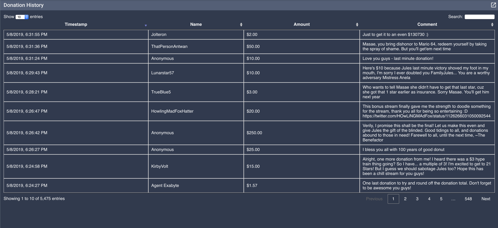

nodecg-tiltify-donation-history is a [NodeCG](http://github.com/nodecg/nodecg) bundle. 
It works with NodeCG versions which satisfy this [semver](https://docs.npmjs.com/getting-started/semantic-versioning) range: `^1.1.1`
You will need to have an appropriate version of NodeCG installed to use it.

This loads all donations into a sortable, searchable, datatable.

